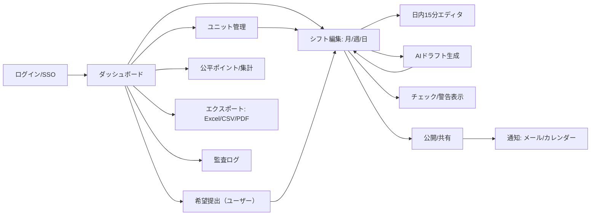

# 介護シフト作成アプリ

介護施設（入所型）におけるシフト作成業務を効率化するための Web アプリケーションです。希望シフトや夜勤制約を踏まえた AI 編成と、公平性ポイントの可視化を組み合わせ、現場のマネジメント負荷を軽減します。

## 目次
- [概要](#概要)
- [主な機能](#主な機能)
- [システム構成](#システム構成)
- [リポジトリ構成](#リポジトリ構成)
- [セットアップ](#セットアップ)
  - [前提環境](#前提環境)
  - [初回セットアップ](#初回セットアップ)
  - [開発サーバー起動](#開発サーバー起動)
  - [よく使うコマンド](#よく使うコマンド)
- [AI 公平ポイントロジック](#ai-公平ポイントロジック)
- [詳細要件](#詳細要件)
- [参考資料](#参考資料)

## 概要
- 月／週／日単位かつ 15 分刻みで柔軟にシフトを作成。
- AI（OpenAI API）による自動ドラフト生成と、夜勤・週末偏りのポイント可視化を実装予定。
- RBAC による権限管理と監査ログで安全性・透明性を担保します。

## 主な機能
- ユニット（チーム）単位でのメンバー管理と希望シフト提出受付。
- ドラッグ＆ドロップによる直感的なシフト編集 UI（15 分刻み編集対応）。
- 夜勤／週末／祝日ポイントを用いた公平性可視化と AI 編成評価指標化。
- シフト公開ワークフロー（下書き→承認→公開）と Excel／CSV／PDF 出力。
- 監査ログ、通知（メール／アプリ内）、iCal/Google 連携を想定。

## システム構成
- バックエンド：Laravel 11 / PHP 8.4
- フロントエンド：React + Vite + Tailwind CSS
- データベース：MySQL
- AI 連携：OpenAI API
- 出力形式：Excel / CSV / PDF

## リポジトリ構成
```text
ai_shift_app/
├─ backend/     # Laravel プロジェクト
├─ frontend/    # React (Vite) プロジェクト
├─ scripts/     # 開発用スクリプト・ユーティリティ
├─ src/         # 共通ドメインドキュメント・図面など
├─ README.md
└─ DEVELOPMENT.md
```

## セットアップ

### 前提環境
- Node.js 20.x 以上（Vite 5 系対応）
- PHP 8.4 以上 / Composer 2 以上
- Python 3.12 以上（`mcp` CLI 利用時）

### 初回セットアップ
```bash
# Laravel 側
cd backend
cp .env.example .env
composer install
php artisan key:generate

# React 側
cd ../frontend
npm install
npm run build
```

### 開発サーバー起動
```bash
# Laravel API を起動（ポートはデフォルトで 8000）
cd backend
php artisan serve

# React フロントをホットリロードで起動（任意）
cd ../frontend
npm run dev -- --host 0.0.0.0 --port 5173

# ビルド済み UI を MCP 開発サーバー経由で確認
cd ..
~/Library/Python/3.12/bin/mcp dev scripts/dev_server.py:server
```

### よく使うコマンド
- `npm run build`：React フロントの本番ビルド
- `npm run lint`：フロントエンドの静的解析（導入予定）
- `php artisan migrate`：Laravel のマイグレーション実行
- `php artisan serve --host 0.0.0.0 --port 8000`：Laravel 開発サーバーポート指定

## AI 公平ポイントロジック
- 夜勤：1 回あたり +3pt
- 週末勤務（土日）：勤務 1 回につき +1pt
- 祝日勤務：勤務 1 回につき +1pt
- 夜勤とカレンダー属性は加算可能（例：土曜夜勤 = 4pt）

### 公平ポイント算出例（2024 年 4 月）

| スタッフ | 夜勤回数 | 夜勤ポイント | 週末勤務回数 | 週末ポイント | 祝日勤務回数 | 祝日ポイント | 月間合計 |
|----------|----------|--------------|--------------|--------------|--------------|--------------|-----------|
| 佐藤     | 4        | 12           | 5            | 5            | 1            | 1            | 18        |
| 鈴木     | 3        | 9            | 6            | 6            | 0            | 0            | 15        |
| 高橋     | 2        | 6            | 4            | 4            | 1            | 1            | 11        |
| 伊藤     | 1        | 3            | 3            | 3            | 0            | 0            | 6         |

勤務シフトを公平ポイント化しダッシュボードへ表示することで、夜勤や週末・祝日勤務の偏りを可視化します。AI 編成時の評価指標や調整指示にも活用します。

## 詳細要件

### 1. 目的 / 背景
- 介護施設（入所型）でのシフト作成業務を効率化し、夜勤や週末の偏りを抑制。
- 希望シフト提出や夜勤制約などを踏まえ、月／週／日単位・15 分刻みで柔軟にシフト作成可能に。
- AI による自動編成を導入し、公平性をポイント制で可視化。

### 2. 対象範囲
- 対象：入所型介護施設（ユニットケア含む）
- 粒度：事業所 > ユニット（例：1AB, 1CD, 2AB, 2CD, 2EF）

### 3. ユーザーロール & 権限

| ロール | 権限 |
|--------|------|
| 管理者 | 全ユーザー・全シフトの閲覧／編集、事業所／ユニット作成、監査ログ管理 |
| チームリーダー | 担当ユニットのシフト作成、メンバー管理、AI 編成実行、公開承認 |
| 一般ユーザー | 自ユニットのシフト閲覧、希望提出、休暇申請 |

### 4. 業務要件

#### 4.1 ユーザー／チーム管理
- ユニット作成・編集（管理者）
- ユニット所属管理（管理者／リーダー）
- ユーザー属性：雇用区分（正社員／パート／アルバイト）、夜勤可否、契約時間

#### 4.2 シフト種別と制約
- シフト種類：早番 / 日勤 / 遅番 / 夜勤 / 休み
- 夜勤：16:30〜翌 9:30（休憩 90 分、夜勤明け翌日は必ず休み）
- 最低配置：ユニットごとに 1 日 4 人（早／日／遅／夜勤 各 1 名）
- 任意時間（半日勤務など）も 15 分刻みで作成可能

#### 4.3 希望シフト / 休暇
- 提出依頼の自動通知
- 締切後も変更可（代行入力不可）
- 休暇申請は承認不要で自動反映

#### 4.4 作成方法
- 手動作成：ドラッグ＆ドロップで割り当て
- AI 作成：希望・制約を踏まえ自動ドラフト生成（OpenAI API）
- 公平性ポイントを算出し、夜勤や週末の偏りを可視化

#### 4.5 出力 / 通知
- シフト公開／下書き管理
- Excel 出力対応（インポート／エクスポート）
- Web／モバイル閲覧、通知（メール／アプリ内）

### 5. 非機能要件
- 対応端末：PC／タブレット／モバイル
- UI/UX：ドラッグ＆ドロップ、カレンダー UI による直感的操作
- セキュリティ：RBAC 認証、SSL 暗号化
- 可用性：高稼働率、障害時ログ保存

### 6. 技術要件
- バックエンド：Laravel 11
- フロントエンド：React + Tailwind CSS
- DB：MySQL
- AI 連携：OpenAI API
- 出力形式：Excel / CSV / PDF

### 7. データモデル（概略）
- `users`：氏名、雇用区分、夜勤可否、契約時間
- `teams`（ユニット）：名称、所属メンバー
- `shifts`：日付、開始／終了、種別
- `assignments`：`shift_id`, `user_id`, 状態（下書き／確定）
- `availability_requests`：希望／休暇申請
- `fairness_points`：ユーザーごとの夜勤／週末偏りポイント
- `organizations`, `memberships`, `shift_types`, `audit_logs` など

### 8. 次アクション
1. 画面遷移図・ワイヤーフレーム作成（ユニット／月間グリッド・日内 15 分編集・AI ドラフト適用）
2. ER 図ドラフト化（`organizations` / `units` / `memberships` / `shifts` / `assignments` / `availability` / `fairness_points` など）
3. Excel 入出力フォーマット定義

### 9. 画面遷移図（ドラフト）


### 10. 主要画面（ワイヤー要件）
- ダッシュボード：未充足枠、夜勤明け違反、提出率、ポイント偏り
- ユニット管理：並び順ドラッグ＆ドロップ、最低配置設定、勤務時刻設定
- 希望提出（ユーザー）：月カレンダー入力、締切／リマインド
- シフト編集：月／週グリッド + 日内 15 分ガント、ドラッグ＆ドロップ割り当て、フィルタ（雇用区分／夜勤可否）
- AI ドラフト：制約確認→生成→差分適用→根拠表示
- 公開／共有：下書き／承認／公開、iCal/Google 連携、Excel 出力
- 公平ポイント：期間・個人別集計、補正ルール
- 監査ログ：操作履歴、ロールバック

### 11. 公平ポイント初期ルール
- 夜勤 = 3pt
- 週末 = 1pt
- 祝日 = 1pt

### 12. 勤務時刻・公平ポイント（確定）
- 早番：07:00–15:45（休憩 60 分）
- 日勤：08:30–17:15（休憩 60 分）
- 遅番：11:45–20:30（休憩 60 分）
- 夜勤：16:30–翌 09:30（休憩 90 分、明け翌日は休みを自動ブロック）
- 公平ポイント初期配点：夜勤 = 3pt、週末 = 1pt、祝日 = 1pt

## 参考資料
- 開発環境の詳細なメモは `DEVELOPMENT.md` を参照してください。
- ER 図や画面遷移図などのドラフトは `src/` ディレクトリで管理しています。

